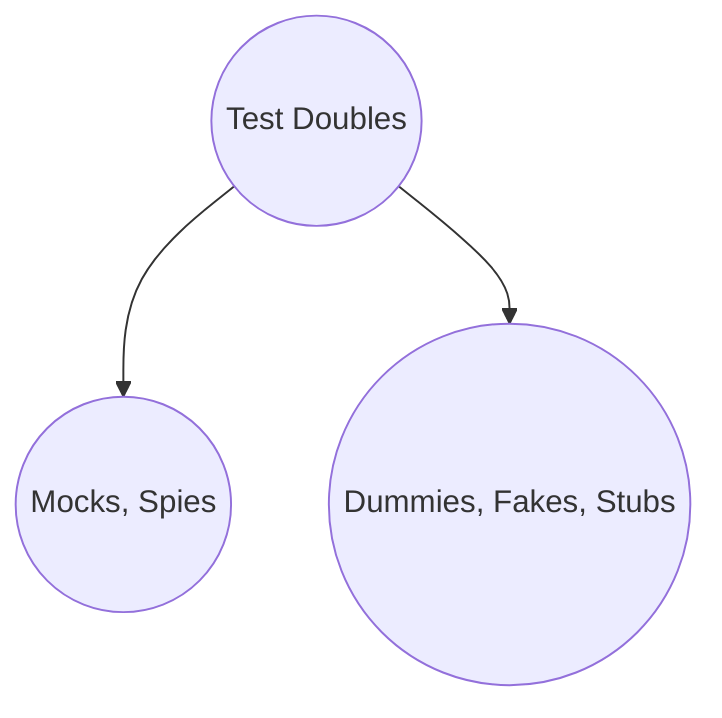

Recently I had a conversation with a colleague regarding the importance of understanding test doubles in order to write fast test suite. Today, let's discuss why understanding is so important for software evolution.

## What are test doubles?
A test double is a generic term to refer to a object that takes place of the real implementation during the automated tests execution and they can be defined as: Dummy, Fake, Stub, Mock, Spies.



- **Dummy** objects passed around but never actually used. Usually they are just used to fill parameter lists.
- **Fake** objects that have some implementation in order to mimic the real implementation. (e.g. HashMap to mimic database storage)
- **Stub** provide answers to calls made during the test. Don't respond to anything outside what's programmed in for the test.
- **Mock** pre-programmed objects that for a given input it will return a given result. That's important to notice that mocks also record information based on how they were called. There is no implemenatation.
- **Spy** has two important characteristics:
    - Contains a real instance inside of it
    - Can be pre-programmed to have a different behavior from the original

## When to use?

### Dummies

We use dummies on tests all the time without having a naming for it because they are simples objects just passing around to fill parameter lists.

```java
@Test
void shouldVerifyThatTheFollowingNamesArePersisted() {
    personRepository.persist(new Person("Daniel"));
    personRepository.persist(new Person("Josep"));
    personRepository.persist(new Person("John"));

    assertArrayEquals(new String[]{"Daniel", "Josep", "John"}, PERSONS.stream().map(Person::name).toArray());
}

```

As you can see *new Person("Some_Name_Here")* is a dummy object because we don't really care about it. We are not using it for any purpose in the test. We are just creating a set of objects in order to test our implementation.


, Fake, Stub
You'll use Dummies, Fakes, Stubs whenever you want to verify how different layers of your application communicate with each other and you don't want to create an integration test for it.

**Wait! Why wouldn't I want to create an integration test?**
As everything in software engineering, that depends. Think about a typical application having the modules: Domain, Application, Infrastructure. As a good practice, you do no want to write integration tests in the Domain and Application modules because they are not supposed to know any kind of infrastructure detail. However, you do want to know how they interact with each other by using a bunch of fake data, fake implementation and dumb objects.

### Mocks and Spies

You'll use mocks whenever the real implementation is not important for the scenario that you are current testings.
[Example]

You'll use spies whenever you want the real implementation running but you also want to verify information about that object (e.g. count how many times it was invoked, verify if it was called or even provoke a behavior that you can't provike easily). 

Mocks and Spies are often associated to the use of a mocking library.
